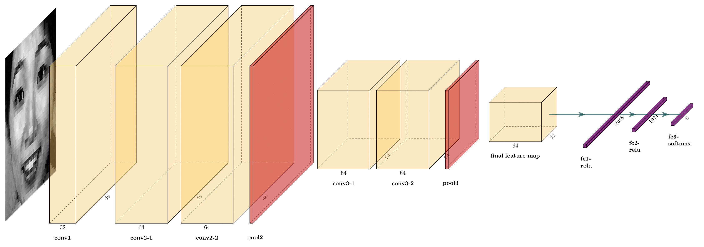

# 人脸表情识别

https://github.com/lianghaofa/computer-vision

## 简介
对人脸表情识别的方法进行比较，重点介绍目前比较流行且颇具潜力的人脸表情识别方法。在实验中实现了基于深度学习的人脸表情识别方法，在FER2013上Pub Test和Pri Test均达到65%左右准确率，JAFFE和CK+5折交叉验证均达到97%左右准确率。

## 环境部署
基于Python3.6和Keras2），具体依赖安装如下。
```shell script
git clone https://github.com/lianghaofa/computer-vision
cd FacialExpressionRecognition
conda create -n FER python=3.6
source activate FER
conda install cudatoolkit=10.1
conda install cudnn=7.6.5
pip install -r requirements.txt
```

## 网络设计
使用经典的卷积神经网络，模型的网络结构设计如下，输入层后加入(1,1)卷积层增加非线性表示且模型层次较浅，参数大量参数集中在全连接层。
<div align="center"></div>
<div align="center"></div>

## 运行步骤
1.下载数据集 
https://pan.baidu.com/s/1DY6LHe3tjyvC1mUuDaupiw   提取码：mo72
<div align="center"></div>
2.项目目录
<div align="center"></div>

## 模型训练
主要在FER2013、JAFFE、CK+上进行训练，JAFFE给出的是半身图因此做了人脸检测。最后在FER2013上Pub Test和Pri Test均达到65%左右准确率（该数据集爬虫采集存在标签错误、水印、动画图片等问题），JAFFE和CK+5折交叉验证均达到97%左右准确率（这两个数据集为实验室采集，较为准确标准）。

执行下面的命令将在指定的数据集（fer2013或jaffe或ck+）上按照指定的batch_size训练指定的轮次。训练会生成对应的可视化训练过程，下图为在三个数据集上训练过程的共同绘图。

```shell
python src/train.py --dataset fer2013 --epochs 300 --batch_size 32
```
<div align="center"></div>
<div align="center"></div>
<div align="center"></div>

## 模型改进
1.对原来模型的数据进行增强
2.对模型的参数进行优化
3.网络集成，网络级联
4.将DL和Handcrafted特征结合，增加网络输入的多样性

## 模型应用
与传统方法相比，卷积神经网络表现更好，使用该模型构建识别系统。预测时对一张图片进行水平翻转、偏转15度、平移等增广得到多个概率分布，将这些概率分布加权求和得到最后的概率分布，此时概率最大的作为标签（也就是使用了推理数据增强）。

## 总结
静态/动态都有一定的应用空间，后者更接近真实客观表情理解。可以看出，除了后面网络集成，网络级联更多的用在刷分，工程意义不大。在对模型进行训练前，需要对数据进行预处理，比如人脸检测，人脸对齐，亮度，对比度归一化，姿态归一化，保证输入数据干扰影响较少。数据增强与常见的图片数据扩展一致，深度网络包括CNN分类/识别/RNN分类，与常见分类任务一致。可以用预训练的分类/人脸识别网络fineturn，可以针对表情修改对应的损失函数，也可以局部或者针对某些层，块进行改进。也可以将DL和Handcrafted特征结合，增加网络输入的多样性。


